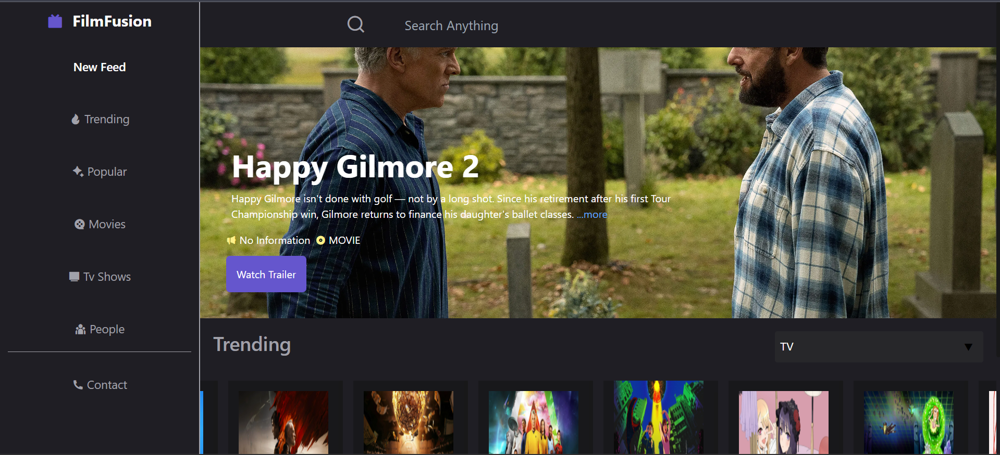
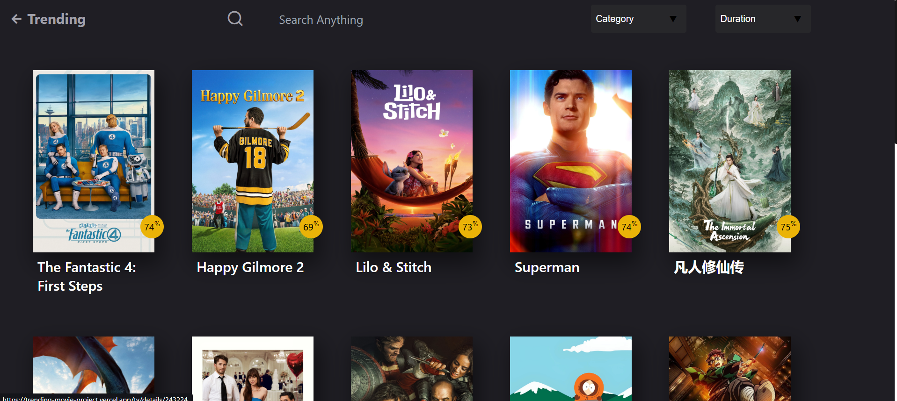
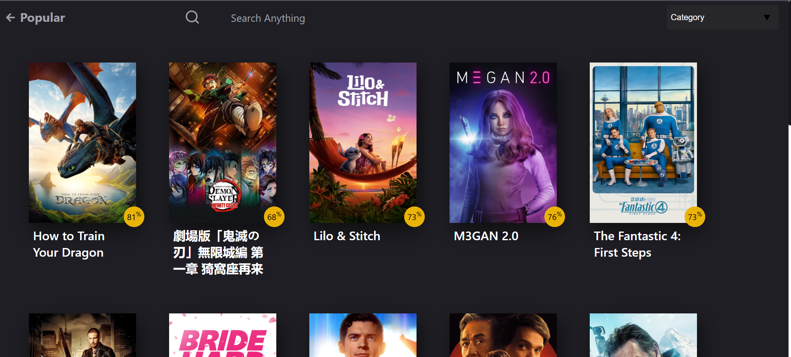
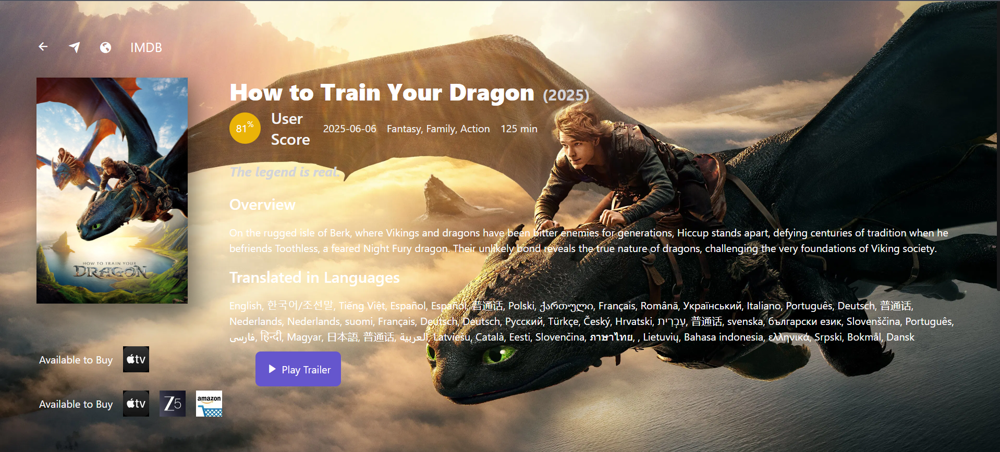
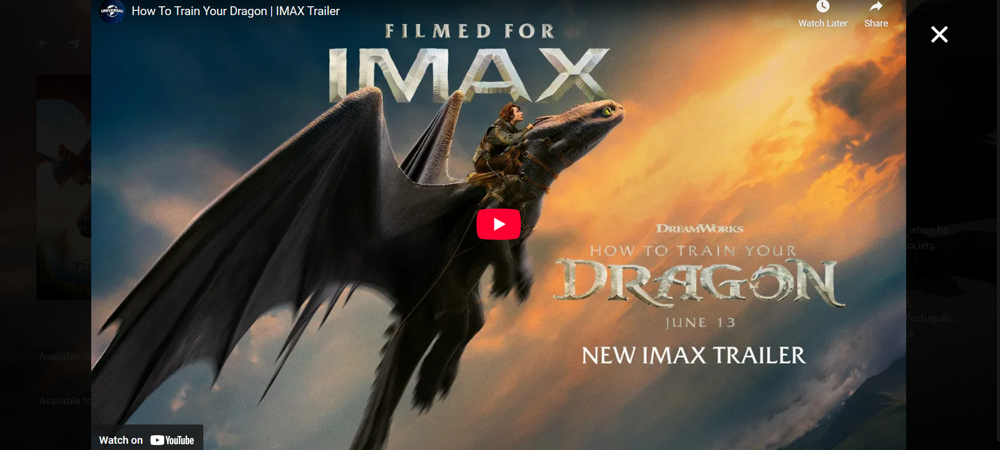

# 🎬 FilmFusion

**FilmFusion** is a dynamic web application that showcases 500+ trending movies and TV shows. Users can explore detailed trailers, cast & crew information, and enjoy a smooth infinite scroll experience.

---

## 🚀 Features

- 🔥 Display trending movies and TV shows
- 🎞️ View trailers, cast, and crew details
- 🔄 Infinite scrolling using `react-infinite-scroll-component`
- 📦 State management using Redux
- 📡 Fetches data using external APIs (like TMDB)

---

## 🛠️ Tech Stack

- **Frontend:** React.js, Redux, JavaScript
- **API:** TMDB (The Movie Database)
- **Styling:** CSS / Tailwind (if used)
- **Others:** React Infinite Scroll

---
## 📸 App Screenshots

### 🏠 Home Screen – Your Movie World Begins Here


### 📈 Trending Now – What Everyone’s Watching


### 🌟 Popular Picks – Most Loved Shows & Movies


### 🧩 Movie Cards – Neat, Clean & Informative UI


### 🎬 Trailer Preview – Watch Before You Watch



---

## 📁 Folder Structure

```
FilmFusion/
├── public/
│   └── images/         # Screenshots or UI assets
├── src/
│   ├── components/     # Reusable components like Cards, Nav, etc.
│   ├── pages/          # Pages like Home, MovieDetails
│   ├── redux/          # Redux slices and store
│   ├── App.js
│   └── index.js
├── .env                # API keys (TMDB API key)
├── package.json
└── README.md
```

---

## ⚙️ Setup Instructions

1. Clone the repository  
   ```bash
   git clone https://github.com/your-username/filmfusion.git
   ```

2. Navigate to the project directory  
   ```bash
   cd filmfusion
   ```

3. Install dependencies  
   ```bash
   npm install
   ```

4. Create a `.env` file in the root directory and add your TMDB API key:  
   ```
   REACT_APP_TMDB_API_KEY=your_api_key_here
   ```

5. Start the development server  
   ```bash
   npm start
   ```

---

## 🌐 API Reference

This project uses [TMDB (The Movie Database)](https://www.themoviedb.org/documentation/api) to fetch movie and TV show data.

---

## 📦 Deployment

You can deploy this app using:
- [Vercel](https://vercel.com/)
- [Netlify](https://netlify.com/)
- GitHub Pages (for static builds using `gh-pages`)

---

## 🤝 Contributing

Contributions are welcome!  
Feel free to fork this repository, open issues, or submit pull requests.

---

## 📧 Contact

**Karthik Raut**  
📧 [karthikraut2@example.com](mailto:karthikraut2@gmail.com)  
🌐 [LinkedIn](https://www.linkedin.com/in/karthik-raut-b5a6a7243) | [GitHub](https://github.com/Karthikraut)


---

## 📄 License

This project is licensed under the [MIT License](LICENSE).